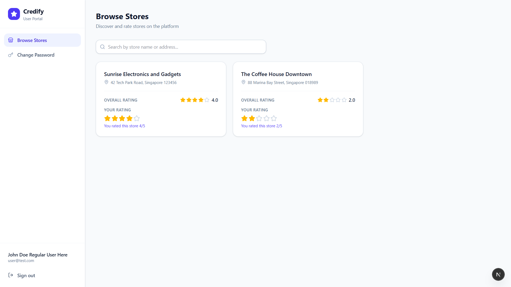
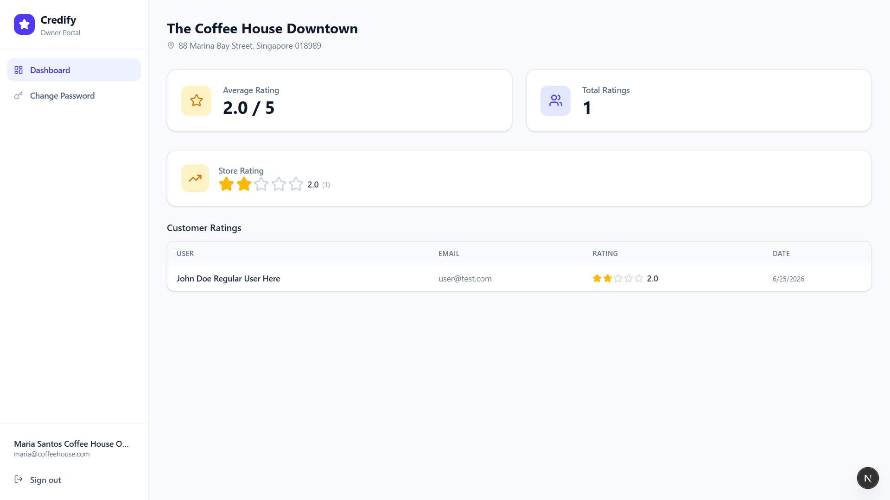
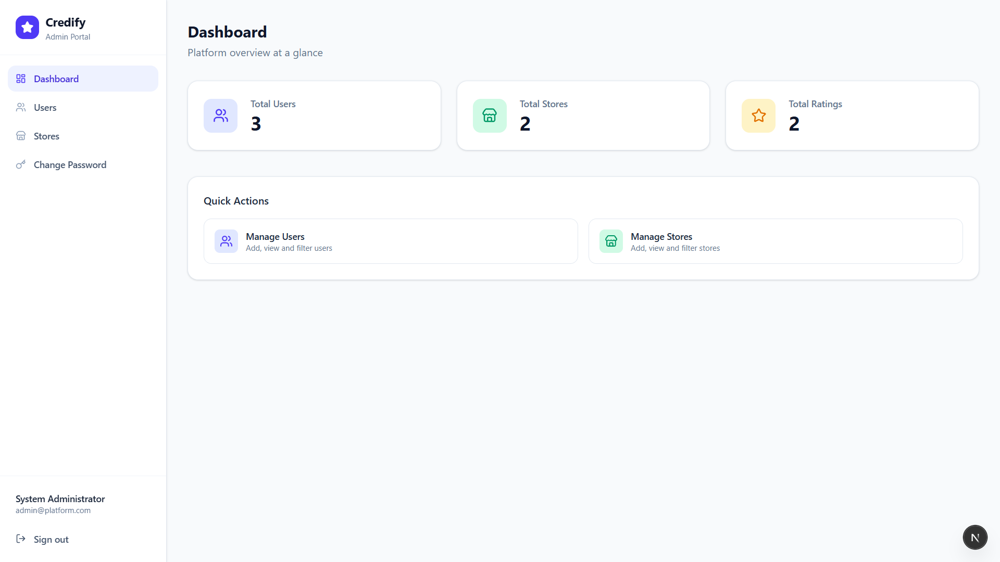
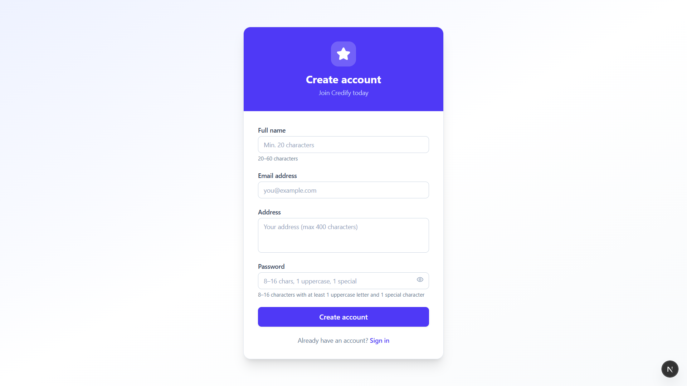
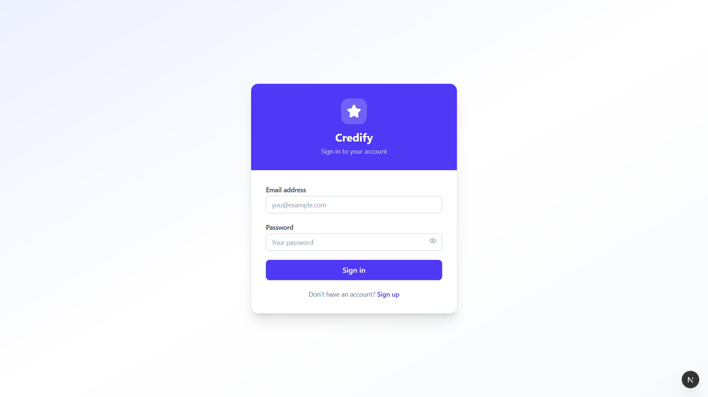

# Credify — Discover & Rate Stores

> A full-stack store rating platform with role-based access control. Users discover and rate stores, admins manage the platform, and store owners track their reputation.


---

## User Interface

- User Dashboard
 
  

- Owner Dashboard
 
  

- Admin Dashboard
 
  

- Sign Up Page
 
  

- Login Page
 
  

---

## Features

### 🛡️ System Administrator
- Dashboard with total users, stores, and ratings count
- Add users (any role) and stores
- View, filter, and sort all users and stores
- Store owners display their store's average rating in the user list

### 👤 Normal User
- Register and log in
- Browse all stores with search by name or address
- View overall store ratings
- Submit or modify a personal rating (1–5 stars) for any store

### 🏪 Store Owner
- View their store's average rating
- See a full list of customers who rated their store

### 🔐 Shared
- JWT-based authentication (stateless, cookie + localStorage)
- Role-based route protection (admin / user / owner)
- Change password with current password verification

---

## Tech Stack

| Layer | Technology |
|---|---|
| **Frontend** | Next.js 16 (App Router) |
| **Styling** | Tailwind CSS v4 |
| **Icons** | Lucide React |
| **Backend** | Express.js (TypeScript) |
| **Database** | Neon (Serverless PostgreSQL) |
| **Auth** | JWT + bcryptjs |
| **Hosting** | Vercel (frontend + backend as serverless functions) |

---

## Project Structure

```
credify/
├── api/
│   └── index.ts              # Vercel serverless entry point (Express)
├── src/                      # Express backend source
│   ├── app.ts                # Express app (CORS, routes) — exported for Vercel
│   ├── server.ts             # Local dev entry point (calls app.listen)
│   ├── lib/
│   │   └── db.ts             # pg Pool (Neon connection)
│   ├── middleware/
│   │   ├── auth.middleware.ts # JWT verification
│   │   └── role.middleware.ts # RBAC role guard
│   ├── controllers/
│   │   ├── auth.controller.ts
│   │   ├── admin.controller.ts
│   │   ├── user.controller.ts
│   │   └── owner.controller.ts
│   └── routes/
│       ├── auth.routes.ts
│       ├── admin.routes.ts
│       ├── user.routes.ts
│       └── owner.routes.ts
├── frontend/                 # Next.js 16 App Router
│   ├── app/
│   │   ├── login/            # Public login page
│   │   ├── signup/           # Public signup page
│   │   ├── admin/            # Admin dashboard, users, stores
│   │   ├── owner/            # Owner dashboard
│   │   ├── stores/           # User store listing & ratings
│   │   └── change-password/  # All roles
│   ├── components/
│   │   ├── ui/               # Button, Input, Table, Modal, StarRating, Badge, StatCard
│   │   └── layout/           # Sidebar
│   ├── context/
│   │   └── AuthContext.tsx
│   ├── lib/
│   │   ├── api.ts            # Axios instance (auto-attaches JWT)
│   │   └── auth.ts           # Token helpers
│   └── proxy.ts              # Next.js 16 route protection (RBAC)
├── migration.sql             # Run in Neon SQL Editor to create tables
├── vercel.json               # Routes /api/* to Express serverless function
├── tsconfig.json
└── package.json
```

---

## Getting Started

### Prerequisites
- Node.js 18+
- A [Neon](https://neon.tech) project (free tier, unlimited projects)

### 1. Clone & Install

```bash
# Install backend dependencies (root)
npm install

# Install frontend dependencies
cd frontend && npm install
```

### 2. Set Up the Database

1. Go to your **Neon dashboard → SQL Editor**
2. Paste and run the contents of [`supabase_migration.sql`](./supabase_migration.sql)

This creates the `users`, `stores`, and `ratings` tables, indexes, and an `updated_at` trigger.

> The file is named `supabase_migration.sql` for historical reasons — it is standard PostgreSQL and works with any Postgres provider.

### 3. Configure Environment Variables

**Backend** — create `.env` in the root directory:

```env
DATABASE_URL=postgresql://<user>:<password>@<host>/neondb?sslmode=verify-full
JWT_SECRET=<your-strong-secret>
PORT=3001
```

> Get your `DATABASE_URL` from **Neon dashboard → Connection Details**.

**Frontend** — create `frontend/.env.local`:

```env
NEXT_PUBLIC_API_URL=http://localhost:3001/api
```

> In production on Vercel, set `NEXT_PUBLIC_API_URL=/api` since frontend and backend share the same domain.

### 4. Seed the Admin Account

The migration inserts a default admin row with a placeholder password hash. After running the migration, reset the admin password by running:

```bash
# From the root directory (after setting up .env)
node -e "
require('dotenv').config();
const bcrypt = require('bcryptjs');
const { Pool } = require('pg');
const pool = new Pool({ connectionString: process.env.DATABASE_URL, ssl: { rejectUnauthorized: false } });
bcrypt.hash('Admin@1234', 12).then(hash => pool.query('UPDATE users SET password = \$1 WHERE email = \$2', [hash, 'admin@platform.com'])).then(() => { console.log('Done'); pool.end(); });
"
```

Default admin credentials after running the above:

| Field | Value |
|---|---|
| Email | `admin@platform.com` |
| Password | `Admin@1234` |

### 5. Run Locally

```bash
# Terminal 1 — Backend (Express)
npm run dev

# Terminal 2 — Frontend (Next.js)
cd frontend && npm run dev
```

- Frontend: [http://localhost:3000](http://localhost:3000)
- Backend API: [http://localhost:3001/api](http://localhost:3001/api)

---

## API Reference

### Auth — `/api/auth`

| Method | Endpoint | Access | Description |
|---|---|---|---|
| `POST` | `/auth/login` | Public | Login, returns JWT |
| `POST` | `/auth/signup` | Public | Register as normal user |
| `PATCH` | `/auth/password` | All (auth) | Change own password |

### Admin — `/api/admin`

| Method | Endpoint | Description |
|---|---|---|
| `GET` | `/admin/dashboard` | Stats (users, stores, ratings count) |
| `GET` | `/admin/users` | List users (filter + sort) |
| `GET` | `/admin/users/:id` | User detail |
| `POST` | `/admin/users` | Create any role user |
| `GET` | `/admin/stores` | List stores (filter + sort + avg rating) |
| `POST` | `/admin/stores` | Create store |

### User — `/api`

| Method | Endpoint | Description |
|---|---|---|
| `GET` | `/stores` | List stores (search + avg rating + own rating) |
| `POST` | `/ratings` | Submit rating (1–5) |
| `PATCH` | `/ratings/:storeId` | Modify own rating |

### Owner — `/api/owner`

| Method | Endpoint | Description |
|---|---|---|
| `GET` | `/owner/dashboard` | Store info + avg rating + raters list |

---

## Form Validation Rules

| Field | Rule |
|---|---|
| **Name** | 20–60 characters |
| **Email** | Standard email format |
| **Address** | Max 400 characters |
| **Password** | 8–16 chars · ≥1 uppercase letter · ≥1 special character |

---

## Deployment (Vercel)

1. Push the project to a GitHub repository
2. Import the repo in [vercel.com](https://vercel.com)
3. Set the following environment variables in Vercel project settings:

```
DATABASE_URL
JWT_SECRET
NEXT_PUBLIC_API_URL=/api
```

4. Set the **Root Directory** to `frontend` for the Next.js build, and leave `vercel.json` at the project root to route `/api/*` to Express.

> Vercel automatically serves the Next.js frontend and the Express serverless function from the same domain — no CORS issues.

---

## License

MIT License - See [LICENSE](./LICENSE.md) file for details
